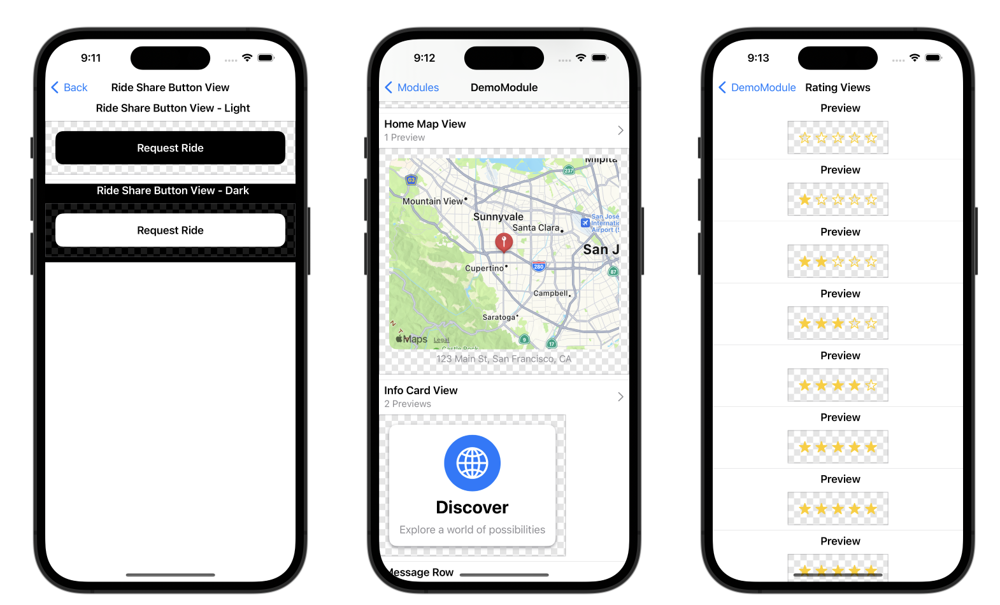

# 📸 SnapshotPreviews

An all-in-one iOS snapshot testing solution.

Emerge handles the heavy lifting of generating, diffing and hosting the snapshots for each build, allowing you to focus on building beautiful UI components.

## Features
 - Automatically generate snapshots of SwiftUI previews.
 - Support for color scheme/orientation.
 - Swift package for easy local validation.

## Generating Snapshots

See [the documentation](https://docs.emergetools.com/docs/swiftui-previews) for how to set up snapshot testing for your app.

## Preview Gallery

`PreviewGallery` is an interactive UI built on top of snapshot extraction. It turns your SwiftUI previews into a gallery of compoents and features you can access from your application. Xcode is not required to view the previews. You can use it to preview individual components (buttons/rows/icons/etc)
or even entire interactive features.

<p align="center">
  
</p>

The public API of PreviewGallery is just one SwiftUI `View` named `PreviewGallery`. Just display this view to get the full gallery. For example, you could add a button like this:

```swift
import SwiftUI
import PreviewGallery

NavigationLink("Open Gallery") { PreviewGallery() }
```

## Local Debugging

Use this Swift Package for locally debugging your views snapshots. You’ll need a UI test target that imports the `SnapshottingTests` and `Snapshotting` products from this package. Create a test that inherits from `PreviewTest` like this:

```
import Snapshotting
import SnapshottingTests

class MyPreviewTest: PreviewTest {

  override func getApp() -> XCUIApplication {
    return XCUIApplication()
  }

  override func snapshotPreviews() -> [String]? {
    return nil
  }
}
```

Note there are no test functions. They get automatically added at runtime by `PreviewTest`. You can return a list of previews from the `snapshotPreviews()` function based on what preview you are trying to locally validate. The previews will be added as attachements in Xcode’s test results. The test must be run on an iOS simulator (not device).


See the demo app for a full example.
